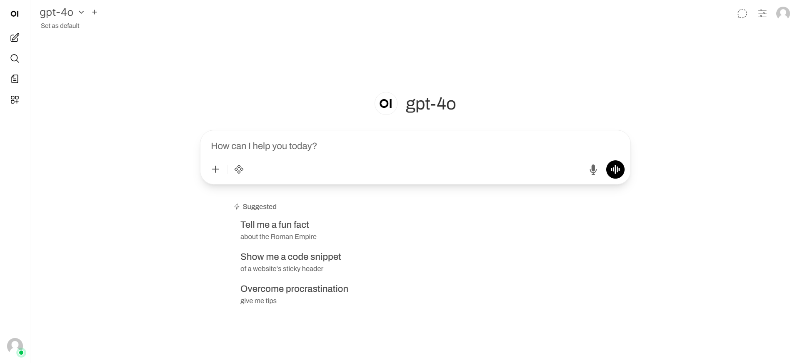
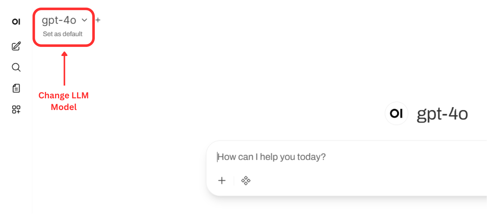
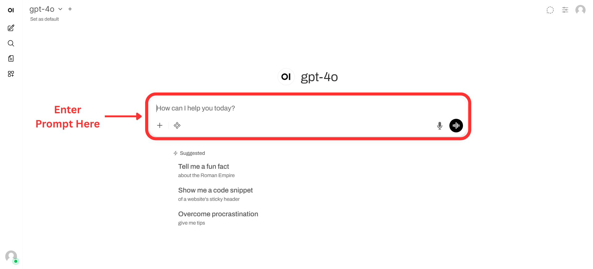
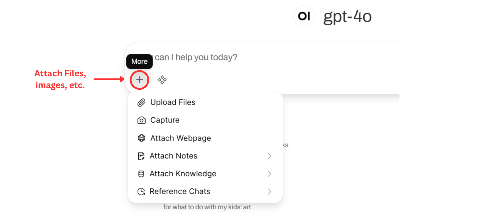
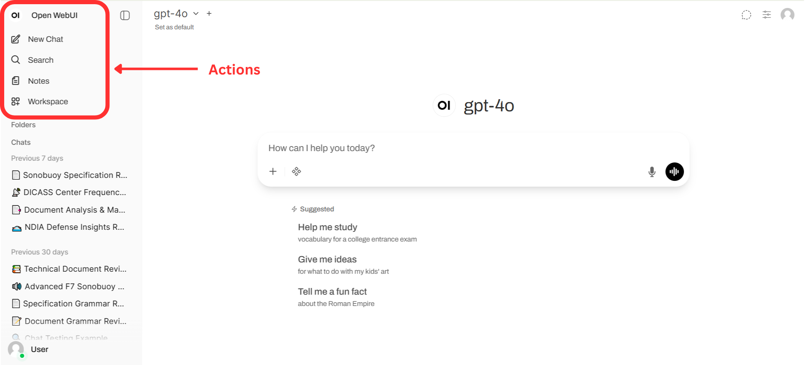

# Open WebUI User Guide

Welcome to the Open WebUI! This step-by-step guide will walk you through the basics of navigating the interface, selecting models, starting your first chat, and using the built-in workspace tools.

---

### Access the WebUI
To get started, open your preferred web browser and navigate to the following address:
* **URL:** `http://10.55.55.1:3000`

---

### Choose Your LLM Model
Before you start chatting, you need to select the AI model you want to use.

1. Look at the top-left corner of the screen.
2. Click on the model dropdown menu (indicated by the red box in the image below).
3. Select your desired model (e.g., `gpt-4o`) from the list.

> **Tip:** You can click "Set as default" right below the model name so you don't have to choose it every time you log in.

---

### Enter Your Prompt
Once your model is selected, you are ready to start generating responses.

1. Locate the main chat box at the bottom of the screen.
2. Type your question, instructions, or prompt into this field.
3. Press **Enter** or click the send button to submit your prompt.

---

###Include Files, Links, and More

If you need the AI to analyze a specific document, image, or website, you can easily attach it to your prompt.

1. Click the **`+`** icon located on the left side of the chat input box.
2. A menu will appear with several options, including **Upload Files**, **Capture**, **Attach Webpage**, and more. 
3. Select the appropriate option and choose the file or link you want to include.

---

### Access Old Chats or Create a New One
Open WebUI automatically saves your previous conversations so you can pick up right where you left off.

1. To open the sidebar, click the **OI** logo in the top-left corner of the screen.
2. The sidebar will slide out. From here, you can click **New Chat** at the top to start a fresh conversation.
3. To resume an old chat, browse your **Previous 7 days** or **Previous 30 days** history in the lower section of the menu.

  
  

---

### Explore Additional Actions & Notes
The side menu also gives you access to a suite of other helpful workspace tools:

1. **Actions:** The upper section of the side menu contains quick links for **Search**, **Notes**, and your broader **Workspace**.
2. **Notes:** Clicking on "Notes" opens a dedicated interface where you can create, organize, and format your own documentation or save important AI outputs alongside your chats.

  
  

---
*If you run into any issues or need further assistance, please reach out to the system administrator.*
